<!-- TERMINAL WINDOW - SYSPROMPT -->
<pre style="background: #0d1117; border: 1px solid #30363d; border-radius: 10px; padding: 8px 0; text-align: center; color: #4dabf7; font-family: 'Consolas', 'Menlo', monospace;">
┌───(rayho@github)─────────────────────────────────────────────────────────┐
│  ~/profile · ━━━━━━━━━━━━━━━━━━━━━━━━━━━━━━━━━━━━━━━━━━━━━━━━━━━━━━  │
└────────────────────────────────────────────────────────────────────┘
</pre>

<!-- SECTION: whoami -->
<pre style="background: #0d1117; border: 1px solid #30363d; border-radius: 10px; padding: 12px 16px; text-align: left; color: #4dabf7; font-family: 'Consolas', 'Menlo', monospace;">
rayho@github:~$ whoami --verbose
</pre>

  

  

<!-- SECTION: contributions -->
<pre style="background: #0d1117; border: 1px solid #30363d; border-radius: 10px; padding: 12px 16px; text-align: left; color: #4dabf7; font-family: 'Consolas', 'Menlo', monospace;">
rayho@github:~$ cat contributions.log
</pre>

  

<!-- SECTION: about -->
<pre style="background: #0d1117; border: 1px solid #30363d; border-radius: 10px; padding: 12px 16px; text-align: left; color: #4dabf7; font-family: 'Consolas', 'Menlo', monospace;">
rayho@github:~$ cat about.md
</pre>

<pre style="background: #0d1117; border: 1px solid #30363d; border-radius: 10px; padding: 20px; text-align: left; color: #c9d1d9; font-family: 'Consolas', 'Menlo', monospace; font-size: 14px; line-height: 1.6;">
┌─ About Me ─────────────────────────────┐
│                                           │
│  * Role       Computer Science Student      │
│  * From       Bangladesh                     │
│  * Focus      Backend + Cloud-Native Systems │
│  * Current    Building a microservice       │
│  *             ecommerce platform           │
│                                           │
└───────────────────────────────────────────┘
</pre>

 

<!-- SECTION: socials -->
<pre style="background: #0d1117; border: 1px solid #30363d; border-radius: 10px; padding: 12px 16px; text-align: left; color: #4dabf7; font-family: 'Consolas', 'Menlo', monospace;">
rayho@github:~$ cat socials --links
</pre>

<pre style="background: #0d1117; border: 1px solid #30363d; border-radius: 10px; padding: 16px; text-align: center; color: #c9d1d9; font-family: 'Consolas', 'Menlo', monospace;">

</pre>

 

<!-- SECTION: tech stack -->
<pre style="background: #0d1117; border: 1px solid #30363d; border-radius: 10px; padding: 12px 16px; text-align: left; color: #4dabf7; font-family: 'Consolas', 'Menlo', monospace;">
rayho@github:~$ ls -la /tools/
</pre>

<pre style="background: #0d1117; border: 1px solid #30363d; border-radius: 10px; padding: 16px; text-align: center; color: #c9d1d9; font-family: 'Consolas', 'Menlo', monospace; line-height: 2.2;">

</pre>

 

<!-- SECTION: stats -->
<pre style="background: #0d1117; border: 1px solid #30363d; border-radius: 10px; padding: 12px 16px; text-align: left; color: #4dabf7; font-family: 'Consolas', 'Menlo', monospace;">
rayho@github:~$ ./stats --profile
</pre>

  
  

  

 

<!-- FOOTER -->
<pre style="background: #0d1117; border: 1px solid #30363d; border-radius: 10px; padding: 10px 16px; text-align: center; color: #8b949e; font-family: 'Consolas', 'Menlo', monospace; font-size: 12px;">
rayho@github:~$ visitors --count    |  uptime ∞  |  status ● online
</pre>

 

